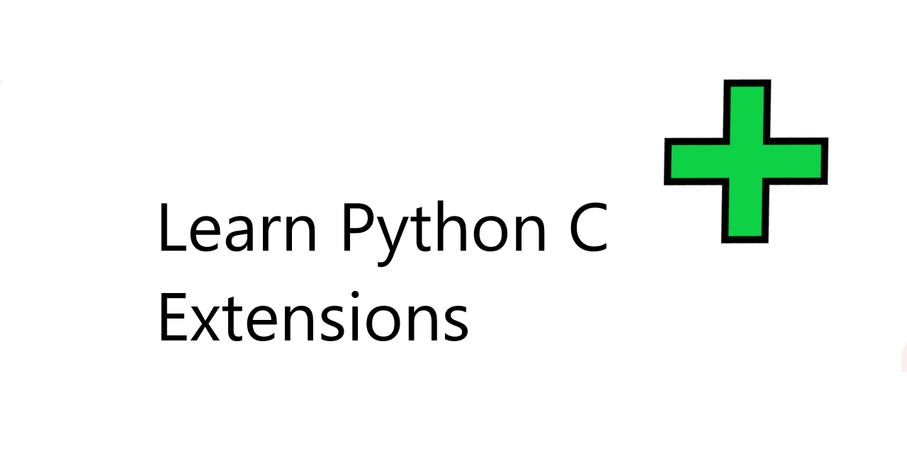

# Royal




## Intro

`royal` is a library and framework for building economic market models.

### Building and Installing

You can then build and install the extension with the following commands.

 ```
 $ python setup.py build
 $ python setup.py install
 ```